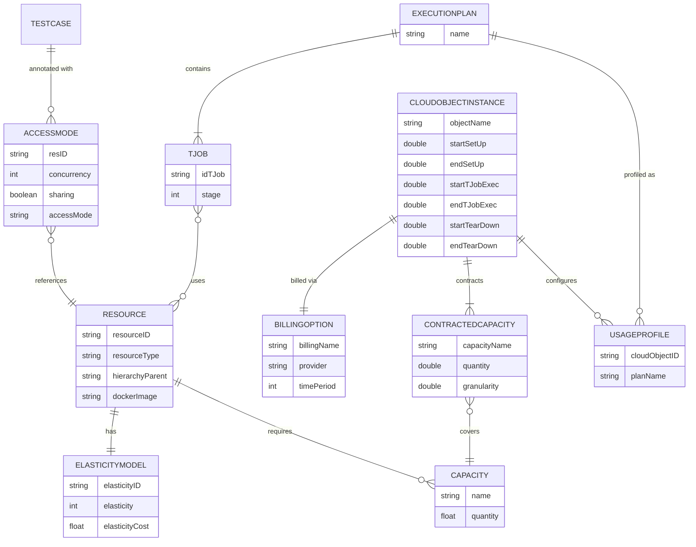

[](https://github.com/giis-uniovi/retorch/actions/workflows/test.yml)
[](https://sonarcloud.io/summary/new_code?id=my%3Aretorch)
[](https://central.sonatype.com/artifact/io.github.giis-uniovi/retorch-annotations)

# RETORCH: Resource-aware End-to-End Test Orchestration

This repository contains a series of components of the RETORCH End-to-End (E2E) test orchestration framework. It's
primary goal is to optimize E2E test execution by reducing both the execution time and the number of unnecessary
Resource[^1] redeployment's.

NOTE: The repository is a work in progress, the initial version only made available the annotations, and currently we're
migrating the orchestration generator module. Additional components will be added in future releases.

[^1]: Henceforth, we will use the term "Resources" (capitalized) when referring to the ones required by the E2E test
suite.

## Contents

- [RETORCH: Resource-aware End-to-End Test Orchestration:]()
    - [Quick Start](#quick-start)
    - [RETORCH Framework Model](#retorch-framework-model)
    - [RETORCH Annotations](#retorch-annotations)
    - [RETORCH Orchestration](#retorch-orchestration)
    - [Contributing](#contributing)
    - [Contact](#contact)
    - [Citing this work](#citing-this-work)
    - [Acknowledgments](#acknowledgments)

## Quick-start

- Add the dependencies [
  `io.github.giis-uniovi:retorch-annotations`](https://central.sonatype.com/artifact/io.github.giis-uniovi/retorch-annotations)
  and [
  `io.github.giis-uniovi.retorch-orchestration`](https://central.sonatype.com/artifact/io.github.giis-uniovi/retorch-orchestration)
  to the `pom.xml` of your SUT.
- Add the annotations to the test classes as indicated below.
- Configure the E2E test suite as indicated below.
- Execute the orchestration generator and generate the pipelining-scripting code.
- Commit and push the generated files to Git.

## RETORCH Framework Model

The diagram below shows the RETORCH data model across its four layers: the test annotation layer, the
orchestration model, the cloud infrastructure configuration, and the usage profiling artefacts.



The key entities are:

- **TestCase / AccessMode** — each E2E test case is annotated with one or more `@AccessMode` entries, each
  referencing a `Resource` by ID.
- **Resource / Capacity** — a `Resource` describes a service or infrastructure component, with minimal
  `Capacity` requirements (memory, processor, storage, slots) and an `ElasticityModel` for scheduling.
- **TJob / ExecutionPlan** — the RETORCH classifier and scheduler group annotated test cases into `TJob`s
  (units of parallel execution) which are arranged into a `ExecutionPlan`.
- **CloudObjectInstance / BillingOption / ContractedCapacity** — the cloud infrastructure configuration
  describing what is provisioned (capacities and granularity), how it is billed, and when each lifecycle
  phase (setup, execution, teardown) takes place.
- **UsageProfile** — the profiling output that connects an `ExecutionPlan` with a specific
  `CloudObjectInstance`, capturing how each contracted capacity is consumed over time.

## RETORCH Annotations

The RETORCH framework provides a set of custom annotations to define and manage Resources used in end-to-end testing.
These annotations allow testers to group, schedule, and characterize Resources. To execute test cases using RETORCH,
each test case must be annotated with at least one `@AccessMode`, and which refers to an already defined Resouce in the
`<SUT_NAME>SystemResources.json` file. Additional information about the `<SUT_NAME>SystemResources.json` can be found
in [RETORCH Orchestration](#retorch-orchestration).

The tester needs to specify the access mode using the following attributes:

- `resID`: Resource identifier for the access mode.
- `concurrency`: The upper bound of test cases that can access the resource concurrently.
- `sharing`: Allows sharing the resource between multiple test cases.
- `accessMode`: The type of access mode performed by the test case.

```java
@AccessMode(resID = "LoginService", concurrency = 10, sharing = true, accessMode = "READONLY")
```

The following code snippets illustrate a test case annotated with multiple `@AccessMode` annotations each one
corresponding to a different Resource:

```java

@AccessMode(resID = "LoginService", concurrency = 10, sharing = true, accessMode = "READONLY")
@AccessMode(resID = "OpenVidu", concurrency = 10, sharing = true, accessMode = "NOACCESS")
@AccessMode(resID = "Course", concurrency = 10, sharing = true, accessMode = "READONLY")
@ParameterizedTest
@MethodSource("data")
void forumLoadEntriesTest(String usermail, String password, String role) {
    this.user = setupBrowser("chrome", TJOB_NAME + "_" + TEST_NAME, usermail, WAIT_SECONDS);
    driver = user.getDriver();
    this.slowLogin(user, usermail, password);
}
```

## RETORCH Orchestration

The RETORCH framework provides a generator that creates the Execution Plan, along with the required pipelining and
script files for execution in a CI environment. The generation of scripts and pipelining code is based on the Access
Modes annotated within the test cases and the Resource information specified in
`.retorch/configurations/<SUT_NAME>SystemResources.json`.

The RETORCH orchestration generator requires 4 inputs:

- The annotated E2E test cases with the [RETORCH access modes](#retorch-annotations) into a **single module** Maven
  project.
- A file with the Resources in JSON format(`<SUT_NAME>SystemResources.json`).
- A properties file (`retorchCI.properties`)  with the Environment configuration.
- A custom `docker-compose.yml` file.

Given these inputs, the generator gives as output the necessary scripting code and the `Jenkinsfile` to execute the E2E
test suite into a Continuous Integration system.

### Prepare the E2E Test suite

The first step is to create several folders to store the configurations and place the `docker-compose.yml`
in the single module project root. The resulting directory tree might look like as:

```
.

├── 📁 .retorch/
│   ├── 📁 configurations/
│   └── 📁 customscriptscode/
├── 📦 src
├── 🐳 docker-compose.yml

```

- The `📁 .retorch/` directory would contain all the configuration files and scripting snippets that would be used to
  generate the pipelining code and the scripts to set up, deploy, and tear down the different Resources and TJob.
  Contains two subdirectories:
    - `📁 configurations/`: stores the Resources and CI configuration files.
    - `📁 customscriptscode/`: stores the different script snippets for the tear down, set up and environment.
- The `docker-compose.yml` in the root of the project.
- The different project directories and files.

The following subsections explain how to create each configuration file and how to prepare the `docker-compose.yml`file.

#### Create the Resource JSON file

The Resource file must be placed in the `.retorch/configurations/` and named with the system or test suite name,
followed by `SystemResources.json` (`<SUT_NAME>SystemResources.json`). This file contains a map with a series of
Resources, using their unique ResourceID as a key.
For each Resource the tester needs to specify the following attributes:

- `resourceID`: A unique identifier for the Resource.
- `replaceable`: A list of Resources that can replace the current one.
- `hierarchyParent`: A resourceID of the hierarchical parent of the Resource.
- `elasticityModel`: The elasticity model of the Resource, is composed by the following attributes:
    - `elasticityID`: A unique identifier for the elasticity model.
    - `elasticity`: Integer with the available Resources.
    - `elasticityCost`: Instantiation cost of each Resource.
- `resourceType`:  String with the type of the Resource(e.g. LOGICAL, PHYSICAL or COMPUTATIONAL).
- `minimalCapacities`: List with the Minimal Capacities required by the Resource; each Capacity is composed by:
    - `name`: String between "memory", "processor" and "storage".
    - `quantity`: float with the amount of Capacity Required.
- `dockerImage`: String with the concatenation of the placeholder name in the docker-compose, using `;` as separator
  between placeholder and the image name.

The following snippet shows an example of two Resources declared in the JSON file:

```json
{
  "userservice": {
    "hierarchyParent": [
      "mysql"
    ],
    "replaceable": [],
    "elasticityModel": {
      "elasticityID": "elasmodeluserservice",
      "elasticity": 5,
      "elasticityCost": 30.0
    },
    "resourceType": "LOGICAL",
    "resourceID": "userservice",
    "minimalCapacities": [
      {
        "name": "memory",
        "quantity": 0.2929
      },
      {
        "name": "processor",
        "quantity": 0.2
      },
      {
        "name": "storage",
        "quantity": 0.5
      }
    ],
    "dockerImage": "userservice;wigo4it/identityserver4:latest"
  },
  "frontend": {
    "hierarchyParent": [],
    "replaceable": [],
    "elasticityModel": {
      "elasticityID": "elasmodelfrontend",
      "elasticity": 1,
      "elasticityCost": 300.0
    },
    "resourceType": "LOGICAL",
    "resourceID": "frontend",
    "minimalCapacities": [
      {
        "name": "memory",
        "quantity": 2
      },
      {
        "name": "processor",
        "quantity": 1
      },
      {
        "name": "storage",
        "quantity": 0.88
      }
    ],
    "dockerImage": "frontend;nginx:latest"
  }
}
```

#### Create the retorchCI.properties file

The CI file must be placed in `.retorch/configurations/`, namely `retorchCI.properties` containing several
parameters related to the SUT and the Continuous Integration Infrastructure, these parameters are the following:

- `agentCIName`: the specific Jenkins agent used to execute the test suite.
- `sut-wait-html`: state in the frontend (HTML displayed) when the SUT is ready to execute the test suite.
- `sut-location`: location of the `docker-compose.yml` file used to deploy the SUT.
- `app-url`: the URL where the frontend of the web application is made available.
- `testsBasePath`: Path to the Java project root.

The following snippet provides an example of how this file looks like:

```properties
agentCIName=any
sut-wait-html=<title>Hello World</title>
sut-location=$WORKSPACE
app-url=https://full-teaching-$TJOB_NAME:5000
testsBasePath=./
```

#### Preparing the docker-compose.yml file

The orchestration generator also requires to parametrize the `docker-compose.yml` used to deploy the application by
means including the necessary environment variables in the containers names and URIs, as well as the placeholders of the
images specified above.
Examples of the necessary changes in the `docker-compose.yml` can consulted in the FullTeaching and eShopOnContainers
repositories:

- FullTeaching:
    - [Original
      `docker-compose.yml`](https://github.com/elastest/full-teaching/blob/master/application/docker-compose/docker-compose.yml)
    - [RETORCH
      `docker-compose.yml`](https://github.com/giis-uniovi/retorch-st-fullteaching/blob/main/docker-compose.yml)
- EshopContainers:
    - [Original `docker-compose.yml`](https://github.com/erjain/eShopOnContainers/blob/dev/src/docker-compose.yml) and [
      `docker-compose.prod.yml`](https://github.com/erjain/eShopOnContainers/blob/dev/src/docker-compose.prod.yml)
    - [RETORCH
      `docker-compose.yml`](https://github.com/giis-uniovi/retorch-st-eShopContainers/blob/main/sut/src/docker-compose.yml)

#### (Optional) Specify script snippets to include in the set-up tear-down and environment

The RETORCH orchestration generator allows to specify scripting code/commands to be included in the generated set up,
tear down, and the environment declaration of each TJob. To include it, the tester must create the following files in
`retorch/customscriptscode`:

- `custom-tjob-setup`: Contains the custom set up code (e.g. declare some environment variable specific for each TJob)or
  custom logging systems.
- `custom-tjob-teardown`: Contains the custom tear down code (e.g. save some generated outputs).
- `custom.env`: Contains configurations and environment variables common to all TJobs.
- `custom-coi-setup`: Contains the custom set up code for the cloud or on-premise infrastructure (e.g. clone a
  repository and made it available for all TJobs).
- `custom-coi-teardown`: Contains the custom tear-down code for the cloud or on-premise infrastructure (e.g. retrieve
  and
  calculate the coverage data or clean certain aspects of the environment).

Examples of the three snippets files can be consulted
in [FullTeaching Test Suite](https://github.com/giis-uniovi/retorch-st-fullteaching)
and [eShopOnContainers](https://github.com/giis-uniovi/retorch-st-eShopContainers).

Once created the different properties and configuration files, the single module directory tree might look like:

```
.
├── 📁 .retorch/
│   ├── 📁 configurations/
│   │   ├── {} <SUT_NAME>SystemResource.json
│   │   └── ⚙️ retorchCI.properties
│   ├── 📁 customscriptscode/
│   │   ├── 📄 custom-tjob-setup
│   │   ├── 📄 custom-tjob-teardown
│   │   ├── 📄 custom-coi-setup
│   │   ├── 📄 custom-coi-teardown
│   │   └── 🔐 custom.env
│   └── 📁 infra/
│       └── {} <SUT_NAME>CloudObjectInstances.json
├── 📦 src
├── 🐳 docker-compose.yml
```

### Executing the Orchestration generator

Once all the files created and the `docker-compose.yml` is prepared, to execute the generator we only need to
instantiate the `giis.retorch.orchestration.generator.OrchestrationGenerator` object and call its
`generateJenkinsfile()` method.
To instantiate this class, first we need to include the appropriate dependency to the `pom.xml` file by adding:

```yaml
<dependency>
<groupId>io.github.giis-uniovi</groupId>
<artifactId>retorch-orchestration</artifactId>
<version><!--SET HERE THE DESIRED VERSION--></version>
</dependency>
```

The calling of this class must be done in the same package of the annotated E2E test cases, in order to be capable to
access to the generated java classes through the Java ClassLoader and extract the RETORCH `@AccessMode` annotations. The
test class can be created using the following template, tuning it as required:

```java
package com.sutexample.functional; // TO-DO Adjust the package name

import giis.retorch.orchestration.classifier.EmptyInputException;
import giis.retorch.orchestration.generator.OrchestrationGenerator;
import giis.retorch.orchestration.orchestrator.NoFinalActivitiesException;
import giis.retorch.orchestration.scheduler.NoTGroupsInTheSchedulerException;
import giis.retorch.orchestration.scheduler.NotValidSystemException;
import org.junit.jupiter.api.Disabled;
import org.junit.jupiter.api.Test;

import java.io.IOException;
import java.net.URISyntaxException;

@Disabled("Exclude to execute this class when pushing the SUT")
class RetorchGenerateJenkinfileTest {
    @Test
    void testGenerateJenkinsfile() throws NoFinalActivitiesException, NoTGroupsInTheSchedulerException, EmptyInputException, IOException, URISyntaxException, NotValidSystemException, ClassNotFoundException {
        OrchestrationGenerator orch = new OrchestrationGenerator();
        orch.generateJenkinsfile("com.sutexample.functional.tests", "sutexample", "./"); // TO-DO adjust the rootPackageNameTests,systemName and jenkinsFilePath parameters 
    }
}
```

The call of the `generateJenkinsfile` method must be done with the following 3 parameters as arguments:

- `rootPackageNameTests`: String that specifies the root package name where tests are located (
  `com.sutexample.functional.tests` in the snippet).
- `systemName`: String that specifies the system name, must correspond with the name used in
  the [Resources JSON file](#create-the-resource-json-file) (`sutexample` in the snippet).
- `jenkinsFilePath`: String with the location where the `Jenkinsfile` will be created, it must be the project root (`./`
  in the snippet).

For example, in the [FullTeaching test suite](https://github.com/giis-uniovi/retorch-st-fullteaching) this test class,
namely `RetorchGenerateJenkinfileTest.java` is available into the `com.fullteaching.e2e.no_elastest.functional.test`

### RETORCH Orchestration generator outputs

The generator provides four different outputs: the pipelining code, the necessary scripts to set up, tear down and
execute the TJobs(`.retorch/scripts/tjoblifecycles`),
the infrastructure(`.retorch/scripts/coilifecycles`) and the different environment files of each TJob (
`.retorch/envfiles`) :

- `⛓️ Jenkinsfile`: located in the root of the project, contains the pipelining code with the different stages in
  sequential-parallel
  that perform the different TJob lifecycle stages.
- `📁 .retorch/scripts/tjoblifecycles` and `.retorch/scripts/coilifecycles` contains the set up, execution, and
  tear down scripts for the TJobs and infrastructure
- `📁 .retorch/envfiles`: contains the generated custom environment of each TJob.

## RETORCH Usage Profiler

The RETORCH framework provides a tool that generates the Usage Profiles for a given infrastructure. Given the
execution data produced by each CI run, the Execution Plan from the orchestration tool, and a Cloud Object
Instance configuration file, the profiler computes how each contracted capacity is used over time and renders
the result as PNG charts.

The profiler requires the following inputs:

- The execution data CSV files generated by the Jenkinsfile scripts (stored in the `artifacts` folder after
  each run).
- The `ExecutionPlan` produced by the orchestration generator.
- A `<SUT_NAME>CloudObjectInstances.json` file in `.retorch/infra/` describing the cloud infrastructure
  alternatives (capacities, billing model, and lifecycle times).

Add the `retorch-profiling` dependency to `pom.xml`:

```xml
<dependency>
    <groupId>io.github.giis-uniovi</groupId>
    <artifactId>retorch-profiling</artifactId>
    <version><!--SET HERE THE DESIRED VERSION--></version>
</dependency>
```

### Create the Cloud Object Instances configuration file

The Cloud Object Instances file must be placed in `.retorch/infra/` and named
`<SUT_NAME>CloudObjectInstances.json`. It is a **JSON array** where each element describes one Cloud Object
Instance (one infrastructure deployment alternative). Multiple entries allow comparing usage profiles across
different providers or instance types.

For each Cloud Object Instance the tester must specify:

- `objectName`: A unique identifier for the Cloud Object Instance.
- `billingOption`: The billing model applied by the cloud provider, with:
  - `billingName`: Name of the billing plan (e.g. `"As-you-go"`).
  - `provider`: Cloud provider name (e.g. `"Azure"`).
  - `invoicedPrices`: A map of capacity name to price per unit (e.g. `{ "memory": 0.5, "slots": 1.20 }`).
  - `timePeriod`: Minimum billing period in seconds (e.g. `3600` for hourly, `1` for per-second).
- `capacitiesContracted`: A map of capacity name to a `ContractedCapacity` object with:
  - `capacityName`: One of `memory`, `processor`, `storage`, `slots`.
  - `quantity`: Total contracted amount.
  - `granularity`: Smallest provisionable unit (e.g. `32` for a full VM, `0.1` for containers, `1` for slots).
- `startSetUp`, `endSetUp`: Relative times (seconds) for the COI setup phase within the profiling window.
- `startTJobExec`, `endTJobExec`: Relative times for the test execution phase.
- `startTearDown`, `endTearDown`: Relative times for the teardown phase.

The following snippet shows an example with one VM-based Cloud Object Instance:

```json
[
  {
    "objectName": "AzureVM",
    "billingOption": {
      "billingName": "As-you-go",
      "provider": "Azure",
      "invoicedPrices": {
        "memory":    0.5,
        "processor": 0.5,
        "storage":   0.5,
        "slots":     1.20
      },
      "timePeriod": 3600
    },
    "capacitiesContracted": {
      "memory":    { "capacityName": "memory",    "quantity": 32.0, "granularity": 32.0 },
      "processor": { "capacityName": "processor", "quantity": 12.0, "granularity": 12.0 },
      "storage":   { "capacityName": "storage",   "quantity": 32.0, "granularity": 32.0 },
      "slots":     { "capacityName": "slots",     "quantity":  8.0, "granularity":  1.0 }
    },
    "startSetUp":    0.0,
    "endSetUp":      3.0,
    "startTJobExec": 4.0,
    "endTJobExec":   3580.0,
    "startTearDown": 3590.0,
    "endTearDown":   3600.0
  }
]
```

### Generate the average lifecycle duration file from the CI execution data

Each execution of the RETORCH Execution Plan produces a CSV file stored in the `artifacts` folder. Collect one
or more of these files into an `executiondata` folder; the tool computes the average durations across all runs.

Instantiate `UsageProfilerToolBox` and call `generateAverageDurationCSVFile()`, specifying the folder
containing the execution data CSVs (`inputPath`) and the output file path (`outputPath`):

```java
UsageProfilerToolBox usageProfiler = new UsageProfilerToolBox();
usageProfiler.generateAverageDurationCSVFile("./executiondata", "./averagedurationfile.csv");
```

### Generate the raw TJob capacity-usage profile

Using the average duration file and the `ExecutionPlan`, generate a raw capacity-usage profile CSV that
records how much of each capacity each TJob consumes at every second of the profiling window:

```java
ProfileGenerator profileGenerator = new ProfileGenerator();
profileGenerator.generateExecutionPlanCapacitiesUsage(
        plan,                        // ExecutionPlan from OrchestrationGenerator
        "./averagedurationfile.csv", // average duration CSV from previous step
        "./output/profile.csv",      // output path for the raw profile
        3600,                        // profiling window in seconds
        1                            // number of execution plan repetitions
);
```

### Generate the COI Usage Profile charts

Pass the system name (used to locate the JSON config), the raw profile CSV, an output folder, and the plan
name to `generateCOIUsageProfiles()`. The method reads every Cloud Object Instance from
`.retorch/infra/<systemName>CloudObjectInstances.json`, computes the contracted-capacity overlay for each, and
saves one set of PNG charts per instance:

```java
usageProfiler.generateCOIUsageProfiles(
        "FullTeaching",          // system name — loads FullTeachingCloudObjectInstances.json
        "./output/profile.csv",  // raw TJob profile from previous step
        "./output/",             // output folder for CSV files and chart images
        plan.getName()           // plan name used to label the charts
);
```

For each Cloud Object Instance defined in the JSON file the profiler writes:

- `<outputPath>profile_<objectName>.csv` — the profile with contracted-capacity rows added.
- `<outputPath><planName>-<objectName>-<capacityName>.png` — one PNG chart per capacity.

### Full example

The following template, used in the same test class as the orchestration generator, shows all steps together:

```java
package com.sutexample.functional; // TO-DO Adjust the package name

import giis.retorch.orchestration.classifier.EmptyInputException;
import giis.retorch.orchestration.generator.OrchestrationGenerator;
import giis.retorch.orchestration.model.ExecutionPlan;
import giis.retorch.orchestration.orchestrator.NoFinalActivitiesException;
import giis.retorch.orchestration.scheduler.NoTGroupsInTheSchedulerException;
import giis.retorch.orchestration.scheduler.NotValidSystemException;
import giis.retorch.profiling.main.UsageProfilerToolBox;
import giis.retorch.profiling.profilegeneration.ProfileGenerator;
import org.junit.jupiter.api.Disabled;
import org.junit.jupiter.api.Test;

import java.io.IOException;
import java.net.URISyntaxException;

@Disabled("Exclude to execute this class when pushing the SUT")
class RetorchGenerateJenkinfileTest {
    @Test
    void testGenerateJenkinsfile() throws NoFinalActivitiesException, NoTGroupsInTheSchedulerException,
            EmptyInputException, IOException, URISyntaxException, NotValidSystemException, ClassNotFoundException {

        // Generate the Jenkinsfile (orchestration step)
        OrchestrationGenerator orch = new OrchestrationGenerator();
        orch.generateJenkinsfile("com.sutexample.functional.tests", "sutexample", "./");

        // Step 1: average lifecycle durations from Jenkins execution CSV files
        UsageProfilerToolBox usageProfiler = new UsageProfilerToolBox();
        usageProfiler.generateAverageDurationCSVFile("executiondata", "./averagedurationfile.csv");

        // Step 2: raw TJob capacity-usage profile over a 3600s window (1 execution)
        ExecutionPlan plan = orch.getExecutionPlan("com.sutexample.functional.tests", "sutexample");
        ProfileGenerator profileGenerator = new ProfileGenerator();
        profileGenerator.generateExecutionPlanCapacitiesUsage(plan, "./averagedurationfile.csv",
                "./output/profile.csv", 3600, 1);

        // Step 3: overlay contracted capacities and generate charts for each configured COI
        usageProfiler.generateCOIUsageProfiles("sutexample", "./output/profile.csv",
                "./output/", plan.getName());
    }
}
```


## Contributing

See the general contribution policies and guidelines for *giis-uniovi* at
[CONTRIBUTING.md](https://github.com/giis-uniovi/.github/blob/main/profile/CONTRIBUTING.md).

## Contact

[Cristian Augusto](https://www.augustocristian.es) - [augustocristian@uniovi.es](mailto:augustocristian@uniovi.es) -
[Software Engineering Research Group (GIIS) - University of Oviedo, ES](https://giis.uniovi.es)

## Citing this work

RETORCH E2E Test Orchestration framework:

- Cristian Augusto, Jesús Morán, Antonia Bertolino, Claudio de la Riva, and Javier Tuya,
  “RETORCH: an approach for resource-aware orchestration of end-to-end test cases,”
  *Software Quality Journal*, vol. 28, no. 3, 2020.
  https://doi.org/10.1007/s11219-020-09505-2 - [Full Article available](https://link.springer.com/article/10.1007/s11219-020-09505-2) - [Authors version](https://digibuo.uniovi.es/dspace/bitstream/handle/10651/55405/RETORCHSQJExtension_BUO.pdf;jsessionid=0E661594C8732B8D2CA53636A31E4FD5?sequence=1) -
  [Download citation](https://citation-needed.springer.com/v2/references/10.1007/s11219-020-09505-2?format=refman&flavour=citation)

RETORCH*: A Cost and Resource aware Model for E2E Testing in the Cloud:

- Cristian Augusto, Jesús Morán, Antonia Bertolino, Claudio de la Riva, and Javier Tuya,
  “RETORCH*: A Cost and Resource aware Model for E2E Testing in the Cloud”,
  *Journal of Systems and Software*, vol. 221 , pages. 112237, 2025.
  https://doi.org/10.1016/j.jss.2024.112237 - [Full Paper available](https://www.sciencedirect.com/science/article/pii/S0164121224002814?via%3Dihub) - [Authors version](https://hdl.handle.net/10651/75794) -
  [Download citation](https://www.sciencedirect.com/science/article/pii/S0164121224002814?via%3Dihub#:~:text=Export%20citation%20to%20text)

## Acknowledgments

This work has been developed under the TestBUS (PID2019-105455GB-C32) and project supported
by the [Ministry of Science and Innovation (SPAIN)](https://www.ciencia.gob.es/)

